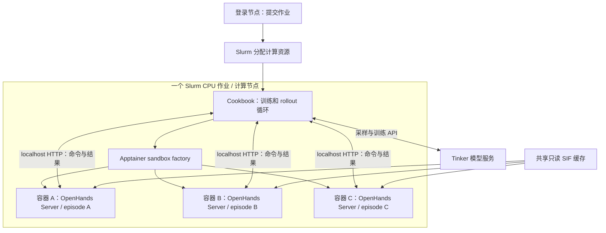

# Rivanna 上的 OpenHands / Apptainer Sandbox 设计

状态：实验性适配层；多容器和小规模 Harbor RL 链路已验证，尚未完成真实任务镜像的批量接入。

## 目标与当前选择

为 Harbor RL 提供可持续多轮交互的执行环境：同一 episode 内保留文件修改，不同 episode 之间使用独立容器。模型采样和训练由 Tinker 服务完成，Rivanna 提供执行工具与 verifier 所需的 CPU 资源。

当前选择是 **Cookbook 与 sandbox 一起运行在 Rivanna 的一个 Slurm 作业内**。这能复用现有 `sandbox_factory` 注入点，减少远程环境创建、服务发现和隧道管理的复杂度。开发时使用交互式 shell，正式训练使用批处理作业，两者共用代码、Python 环境和 SIF 缓存。

本文保留实现边界、验证结论和后续方向；临时 smoke 脚本及自建测试题不作为正式训练入口保留。

## 组件边界

| 组件 | 职责 | 不承担的职责 |
| --- | --- | --- |
| Slurm | 分配节点、CPU、内存与运行时间，管理作业生命周期 | 不感知题目、agent 轮次或 reward |
| Cookbook | 调用模型、组织 rollout、执行工具调用、计算优势、提交训练和保存 checkpoint | 不提供底层容器运行时 |
| Sandbox factory / adapter | 为 episode 创建环境，将异步接口映射为 OpenHands 操作，执行清理 | 当前没有资源调度、池化或远程创建服务 |
| Apptainer | 从 SIF 启动容器，提供运行环境和文件系统隔离机制 | 不决定 agent 下一步行动 |
| OpenHands Agent Server | 在一个已有容器中通过 HTTP 执行命令、读写文件 | 不自动向 Slurm 申请资源，不自动创建独立容器池 |
| Tinker 服务 | 模型采样、前反向计算、优化器操作和模型 checkpoint | 不直接执行题目里的 bash 命令 |

`ApptainerWorkspace` 是运行在调用方进程中的 Python 管理类。它在**调用它的机器**上执行 `apptainer`，启动容器内的 Agent Server，并连接其 HTTP API。它不是自动访问远端集群的客户端。



## 三种生命周期

| 对象 | 典型生命周期 | 复用方式 |
| --- | --- | --- |
| Slurm 作业 | 一次申请，可持续数小时 | 期间运行许多题目和 rollout |
| 任务 SIF | 从镜像构建完成到缓存失效 | 跨 episode、跨作业复用 |
| Episode 容器 | 开始做题到 verifier 完成 | 只在该 episode 的多轮交互之间复用 |

**换题不要求重新申请 Slurm；同一作业不限制为一个容器。** 资源充足时多个 episode 可以并发。同一题目的多个独立 rollout 也应分别创建容器。只有作业结束、时间到期或需要额外资源时，才需要新的资源申请。

Partition 决定可申请的资源、排队和时间规则。`interactive` 队列名称与 agent 的“多轮交互”不是同一概念。取得交互式终端依靠 `srun --pty`；`sbatch` 作业也能同时运行多个持续交互的 agent 环境。

## 单个训练 batch 的 workflow

1. 预先准备任务 SIF；不要让首次镜像转换阻塞训练中的每个 rollout。
2. 用 Slurm 申请一批 CPU / 内存，在计算节点启动 Cookbook。
3. 加载任务的 instruction、environment 描述和 verifier。
4. `cli_main` → `HarborDatasetBuilder` → `HarborEnvGroupBuilder.make_envs()` → `sandbox_factory(env_dir, timeout)`。
5. Factory 选择该任务的预构建 SIF；每次调用启动一个新的 OpenHands/Apptainer 环境。
6. Cookbook 将观察发送给 Tinker，得到模型输出；bash 工具通过 adapter 把命令发给对应 OpenHands Server。
7. 将 stdout、stderr 和 exit code 作为下一轮观察。同一个 episode 使用同一个容器。
8. Episode 结束后，`HarborReward` 上传 `/tests`，运行 verifier，读取 `/logs/verifier/reward.txt` 或 `reward.json`。
9. 回收容器，释放该 episode 的进程和可写状态。Slurm allocation 仍可继续使用。
10. Cookbook 在组内计算优势，提交 Tinker 训练操作，保存 checkpoint，并继续后续 batch。

持久文件状态不等于持久 shell 会话。不要依赖上一条命令的 `cd` 或未导出的 shell 变量；命令应明确指定目录，长期状态写入文件。

## 当前代码与接口

- [`apptainer_sandbox.py`](apptainer_sandbox.py)：实现 `SandboxInterface` 的命令、读写文件、heartbeat 和 cleanup；通过 `asyncio.to_thread` 调用同步 OpenHands API。
- [`harbor_env.py`](../recipes/harbor_rl/harbor_env.py)：已有 factory 注入链路；将 Modal import 延迟到默认 Modal factory 内，使自定义后端不要求安装 Modal。
- [`sandbox_interface.py`](sandbox_interface.py)：保持原有协议，训练循环不需要了解 Apptainer。

选择任务镜像的约定：

```text
task/
  instruction.md
  environment/
    sif.path             # 指向已构建 SIF，绝对路径或相对此目录的路径
    # 或 agent-server.sif
  tests/
    test.sh
  task.toml
```

```python
from tinker_cookbook.recipes.harbor_rl.train import cli_main
from tinker_cookbook.sandbox.apptainer_sandbox import apptainer_sandbox_factory

await cli_main(config, tasks, sandbox_factory=apptainer_sandbox_factory)
```

这段代码必须在有 Apptainer 的执行节点上运行。当前 factory 只读取明确的 SIF 路径，**不会解析 Dockerfile，也不会用通用镜像偷偷替代题目镜像**。

## 镜像准备与缓存

Harbor 任务可以有不同的系统依赖、文件和启动要求。接入真实数据集时，需要保留这些要求，并将兼容版本的 OpenHands Agent Server 与正确入口加入任务镜像，然后转换为 SIF。

```text
任务 Dockerfile / 构建上下文
    → 保留任务依赖并加入 Agent Server
    → 构建 OCI 镜像
    → 转换为 SIF
    → 建立 task → SIF 映射
    → 训练时反复创建新容器
```

OpenHands 1.45.0 的该 workspace 实现支持预构建镜像或已有 SIF，不提供任意 Harbor Dockerfile 的自动构建路径。镜像构建在支持的构建环境中提前完成；Rivanna 上不假设有 Docker daemon。

同一任务的多个 rollout 共享只读 SIF，但各自拥有独立的可写环境。镜像首次准备时间与缓存启动时间必须分开计量。OCI 层缓存可以减少重复下载，不能保证不同 SIF 的转换成本被完全消除。

建议将 `APPTAINER_CACHEDIR`、SIF、下载缓存放在 `/scratch/$USER/`。Scratch 没有备份，应视为可重建存储，并遵循集群当前的清理策略。Git 中保留构建定义、版本和映射；不要只保存不可重建的 SIF。后续缓存键应包含任务构建上下文、基础镜像 digest 和 Agent Server 版本，避免内容变化却复用旧镜像。

## 并发和资源边界

一个作业可以同时运行多个容器，Slurm 为作业提供总资源边界。**当前 adapter 不为每个容器单独划分 CPU、内存或网络资源。** 必须根据实际任务开销限制存活环境数量；不能把启动测试的内存值当成所有任务的容量公式。

现有 Harbor builder 在一个 group 内顺序创建环境，但环境创建后可以同时存活并执行 rollout，不同 group 的创建也可重叠。后续可增加有界的并发启动和容量管理。限制应作用于同时存活的 sandbox，并在 cleanup 完成后释放名额；不要在一个 group 尚未创建齐、又不释放名额时造成死锁。

每个 Agent Server 使用不同的 API 端口。Apptainer 采用 host networking，容器之间并没有独立网络命名空间保证。任务自己启动数据库、HTTP 服务等时也要处理端口冲突。

OpenHands 默认的 VSCode 辅助服务在并发试验中使用同一个 8001 端口，出现额外启动等待。当前通过 `OH_ENABLE_VSCODE=false` 并显式转发该变量关闭它。Harbor 的 bash 工具不需要该服务。

## 权限、文件和清理

测试配置使用 `use_fakeroot=True`、`enable_docker_compat=True`，并保留 OpenHands 禁用系统默认 bind paths 的配置。Tinker API key 留在 Cookbook 进程；不加入容器转发变量，不挂载用户 home 或整个项目目录。集成试验确认容器环境中没有 Tinker key。

测试账号没有直接的 subuid 映射，Apptainer 使用 root-mapped namespace 与 host fakeroot 的组合。简单文件操作、程序执行和 verifier 已成功，但这不代表拥有完整 root 语义，任意 `apt install`、`chown`、切换用户或系统服务仍需逐题验证。

Rebase 到 `science-rl` 后，`HarborBashTool` 使用 `workdir=None`。Adapter 从 `task.toml` 的 `environment.workdir` 读取默认容器工作目录；调用方显式指定的目录优先，因此 verifier 仍可从 `/root` 运行。未填写该配置时沿用 OpenHands 的默认目录；adapter 不解析 Dockerfile 的 `WORKDIR`。

`cleanup()` 返回后，HTTP listener 可能稍晚退出。Adapter 在上游 cleanup 后增加最多 20 秒的端口关闭等待，以实际停止监听作为检查条件。这不等于已经验证所有子进程和端口都被完整回收。

当前限制：

- 生命周期上限在命令提交时检查，并限制该命令剩余时间；没有独立的 idle TTL 回收器。
- heartbeat 只检查 adapter 是否已经关闭，不做服务健康检查或延长 Slurm 时间。
- 同步启动包装为线程；取消过程中如何处理尚未返回的容器启动仍需完善。
- 输出截断发生在客户端收到结果之后，不限制服务端输出缓冲的峰值内存。
- 空闲容器、失败启动、作业信号、端口预留和孤儿进程回收仍需生产级管理。

因此目前适合有界集成实验，不应直接当成完整的多租户 sandbox 服务。

## 远程控制方案及取舍

Cookbook 技术上可以放在本机。已验证的网络路径是：

```text
本机 Cookbook → 本机 localhost 转发端口 → SSH 登录节点 → 计算节点服务端口
```

测试中登录节点访问计算节点成功，SSH 本地转发也成功；测试电脑直连计算节点 IP 超时。这个结果只描述该来源网络，不能推导整个校园网都无法直连。Slurm 本身不提供任意端口的校园网发布保证。

```bash
ssh -N -L 127.0.0.1:18010:COMPUTE_NODE:SERVER_PORT USER@login.hpc.virginia.edu
```

之后本机客户端可以访问 `http://127.0.0.1:18010`，执行 API 仍应使用 OpenHands session key。作业结束后原节点/端口失效。

| 方案 | 优点 | 代价 / 当前状态 |
| --- | --- | --- |
| Cookbook 与容器同一 Slurm 作业 | localhost 通信、凭证只需进入 driver、部署组件少 | 代码需要远程编辑或同步；当前已验证，优先采用 |
| 本机 Cookbook，远程 sandbox | 本地调试体验，训练控制与执行节点分离 | 需要远程创建/销毁 API、服务发现、隧道、重连、认证和容量管理；尚未实现 |
| SandboxFusion | 现有 `code_rl` 的 `/run_code` 接入简单 | 不直接满足当前 Harbor adapter 所需的持续任务环境和逐任务镜像管理 |

OpenHands 只用作执行层，不接管 Cookbook 的模型调用循环。这样可以继续使用 Cookbook 原有的 renderer、轨迹、奖励和训练逻辑。

## 交互调试与正式运行

调试时先申请 shell，再在计算节点里激活环境、运行脚本或 debugger：

```bash
ssh USER@login.hpc.virginia.edu
source /etc/profile
srun --partition=interactive --account=YOUR_ALLOCATION \
  --nodes=1 --ntasks=1 --cpus-per-task=8 --mem=24G \
  --time=02:00:00 --pty bash -l

module load apptainer/1.4.5
cd /path/to/tinker-cookbook
source /path/to/venv/bin/activate
python -m pdb your_harbor_launcher.py
```

使用当前实际可用的 allocation、partition 和软件版本。在已有 allocation 的 shell 中反复调试不需要每次重新排队；达到时间上限或连接中断仍需处理会话生命周期。正式运行用 `sbatch` 启动同一 launcher，明确日志和信号清理。

## 已验证的结果与不代表的结论

2026-09-07，Python 3.12.12、Apptainer 1.4.5、OpenHands workspace / SDK / Agent Server 1.45.0。集成训练使用 Tinker SDK 0.27.1。

| 实验 | 结果 |
| --- | --- |
| 首次通用镜像准备 | 包安装、下载、SIF 转换与首次检查合计约 10 分钟；不是纯启动耗时 |
| 缓存 SIF 的两次顺序启动 | 8.06 / 9.06 秒 |
| 一个作业内三个容器并发启动 | 关闭 VSCode 后均约 9.1 秒 |
| 三段 3 秒命令并发 | 共同执行区间约 2.999 秒 |
| 文件状态 | 相同路径写入不同内容，互不覆盖；多轮修改保留 |
| Verifier 与回收 | 各容器 reward 正确，listener 关闭检查通过，约 2.2 秒 |
| 小规模 Harbor RL | 两个自建格式测试题、每题两个 rollout，共 21 轮，四条轨迹 reward 均为 1.0 |
| 训练链路 | 完成一次训练调用及最终 state / sampler checkpoint 保存，Slurm 正常退出；作业约 2 分 12 秒 |
| 回归检查 | 现有 Harbor 工具 / factory 测试 10/10 通过，lint 通过 |

RL 试验使用 `Qwen/Qwen3-30B-A3B-Instruct-2507`，LoRA rank 8，最多 6 轮，每轮生成上限 1024 tokens。一个 rollout 达到轮次上限，但其文件已通过 verifier，现有 recipe 仍给正奖励。后续应明确 truncation 的奖励语义。

四条轨迹的组内奖励相同，中心化 advantage 为零。因此该试验验证了**采样 → 多轮工具 → 判题 → 训练调用 → checkpoint** 链路，不能证明产生有效策略学习或提升任务成功率。SDK 在成功退出时出现 futures-poller pending-task 警告，尚未修复；作业退出码和 checkpoint 保存正常。

多容器测试复用了同一个通用 SIF，RL 题目使用显式初始化脚本。尚未验证：真实 Terminal-Bench 逐题镜像转换、不同任务镜像并发、混合奖励训练、长期高并发稳定性、任意安装命令和完整容器安全边界。

## 下一阶段

1. 选择少量真实 Harbor 任务，补齐镜像构建、任务工作目录和启动语义；先用已知正确解验证环境。
2. 增加显式容量管理、超时/取消/信号处理，验证进程及可写层回收。
3. 使用有奖励差异的小 batch 验证非零优势和训练信号，再扩展任务数量与并发。
4. 固定镜像 digest、依赖及任务内容版本，提供正式 launcher 和可复现构建流程。
5. 只有确需本机控制或多节点调度时，再引入远程 sandbox 管理服务。

## 参考

- [OpenHands Apptainer 指南](https://docs.openhands.dev/sdk/guides/agent-server/apptainer-sandbox)
- [OpenHands v1.45.0 Apptainer 实现](https://github.com/OpenHands/software-agent-sdk/blob/v1.45.0/openhands-workspace/openhands/workspace/apptainer/workspace.py)
- [Apptainer fakeroot 说明](https://apptainer.org/docs/user/1.4/fakeroot.html)
- [UVA HPC 访问入口](https://rc.virginia.edu/request-manage/ssz-login)
- [UVA RStudio/Apptainer 指南（归档，供背景参考）](https://archive.rc.virginia.edu/userinfo/howtos/rivanna/launch-rserver/)

## GPU 与 MIG 接入

适配器读取 `task.toml` 的 `environment.gpus`，大于零时传递
`ApptainerWorkspace(enable_gpu=True)`，由 OpenHands 添加 `apptainer run --nv`。
在 Slurm 作业中要求已有 `CUDA_VISIBLE_DEVICES` 并原样透传，包括 MIG UUID；
适配器不申请 GPU，也不把 `gpus` 数值变成设备配额。`gpu_types` 的硬件匹配仍由
launcher/Slurm allocation 和镜像编译架构负责，不能认为启用开关就完成了调度。

2026-09-08 实时 Slurm 配置的 `gpu-mig` 提供 RTX PRO 6000 `1g.24gb` 切片。
相应任务镜像需要兼容 Blackwell 的 CUDA 工具链和编译架构。多个容器可共享
同一作业的可见设备，但它们会竞争同一 MIG 切片资源；MIG 的硬隔离边界是切片，
不是每个 OpenHands workspace。CPU-only 题默认不启用 GPU 透传。

当前 factory 仍在 driver 所在节点创建容器。CPU 大内存作业不能直接调用另一个
GPU allocation 的本地 factory；混合训练要么整个 driver 在 GPU 节点运行，
要么增加按任务路由到 CPU/GPU worker 的远程管理层。后者尚未实现。


## 高并发启动与离线评测修正（2026-09-08）

启动时在进程内保留服务端口租约，并从 10000–29999 选取可绑定端口，避开
本次节点的客户端临时端口范围 32768–60999。每个容器使用不同名称的环境标记，
通用健康检查后还必须返回自己的标记；身份不匹配时终止其本地进程并报错。
这避免把另一个容器的健康响应误认为启动成功。端口租约在成功回收后释放。
多 driver 的全局端口协调尚未实现，但初始身份校验会拒绝错误的端点。

`allow_network=False` 为每次任务命令创建新的 user/network namespace：
`unshare --user --map-root-user --net -- /bin/bash -c ...`。Agent Server 仍使用
宿主网络；模型工具命令与 verifier 在无外部网络的子命名空间执行。创建时先
验证内核允许这种模式，不支持时直接失败。此模式不适合要求跨命令共享本地
网络服务的任务，也不是完整的容器安全审计结论。

64 个新容器已通过不同端口、同路径独立文件读写、外网不可达和回收检查。
精确模型 `thinkingmachines/Inkling:peft:262144:sampling-nvfp4` 的 tokenizer、
renderer 与实际 Tinker 采样均通过预检。相关回归测试 48 项通过。
